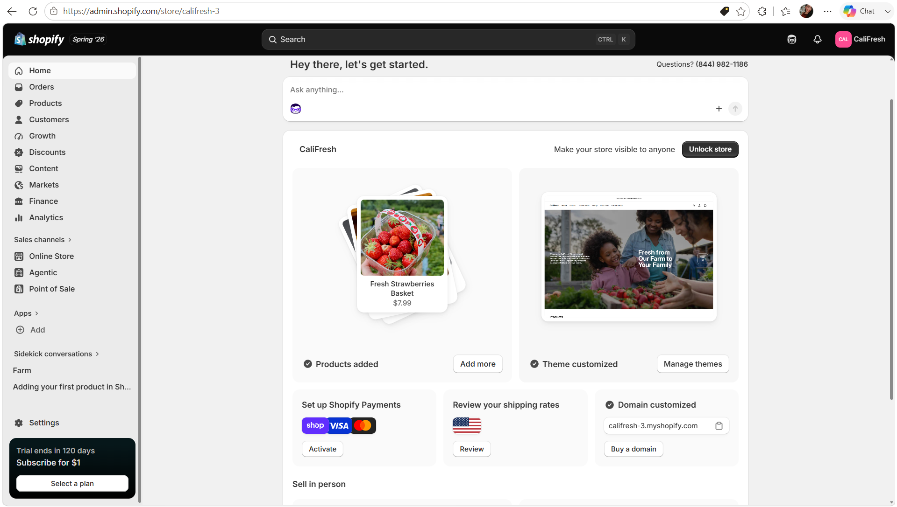
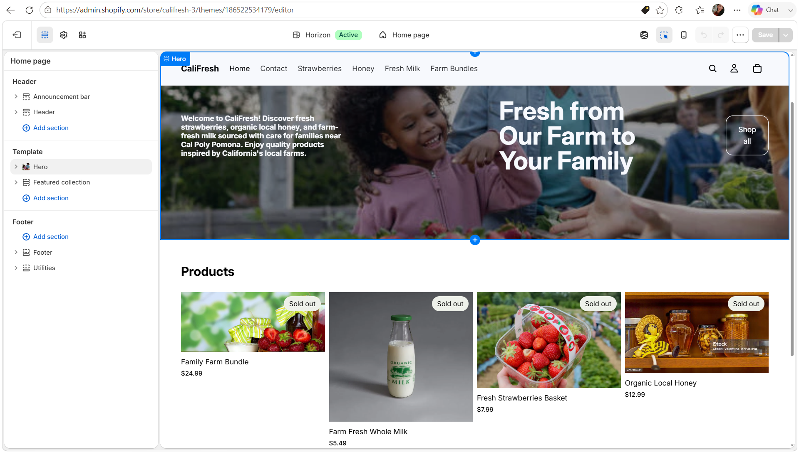

# Store Name and Concept

## Store Name

**CaliFresh**

## Store Concept

CaliFresh is a fictional farm store located near Cal Poly Pomona. The store sells fresh, local, and farm-style products for families living in the surrounding communities who want convenient access to high-quality food. Inspired by the CPP Farm Store, CaliFresh focuses on providing fresh strawberries, organic local honey, farm-fresh milk, and carefully selected farm bundles. The goal of the store is to create a welcoming online shopping experience that encourages customers to support local agriculture while enjoying fresh products for their families.

> CaliFresh is a practice Shopify store created for educational purposes only. No real payments or transactions are processed.

::: {.callout-note}
This Shopify store was created as part of the ITP-W04 Shopify Assignment and is intended only for educational practice.
:::

# Target Customer

The target customers for CaliFresh are families living near Cal Poly Pomona, including residents of Pomona, Walnut, Diamond Bar, Chino Hills, and neighboring communities. These customers value fresh, locally sourced food and prefer shopping at businesses that support local agriculture.

Their lifestyle includes preparing meals at home, purchasing healthy products for their families, and supporting local farms whenever possible. Similar to customers of the CPP Farm Store, they appreciate seasonal produce, fresh dairy products, local honey, and a convenient shopping experience.

# Product Category Plan

| Product Category | Example Products | Purpose |
|------------------|------------------|---------|
| Strawberries | Fresh Strawberries Basket | Fresh seasonal fruit |
| Honey | Organic Local Honey | Local natural products |
| Fresh Milk | Farm Fresh Whole Milk | Fresh dairy products |
| Farm Bundles | Family Farm Bundle | Convenient family packages |

# Initial Shopify Setup Evidence

The following screenshots show the initial setup and customization of the CaliFresh Shopify store.

## Shopify Admin Area

## Selected Theme

The selected Shopify theme is **Horizon**, a clean and modern theme that provides a simple layout suitable for showcasing fresh farm products and creating a user-friendly shopping experience.

## Homepage Draft

The homepage was customized to reflect the CaliFresh brand by featuring a welcoming banner, fresh farm imagery, and highlighted products such as strawberries, honey, fresh milk, and family bundles.

# Connection to CPP Farm Store

Developing CaliFresh helped me better understand how the CPP Farm Store could improve its online retail presence. Both stores focus on providing fresh, locally sourced products to families and community members near Cal Poly Pomona. Creating product categories, organizing collections, selecting an appropriate theme, and designing a welcoming homepage demonstrated how a well-structured online store can improve customer experience. This exercise also provided valuable insight into how similar design and merchandising strategies could be applied during the future CPP Farm Store consulting project.

# Appendix

## GitHub Repository

Add your GitHub repository URL here.

## GitHub Pages Website

Add your GitHub Pages URL here.

---

**Note:** CaliFresh is a fictional Shopify store created solely for educational purposes. No real products are sold and no real financial transactions occur through this store.
